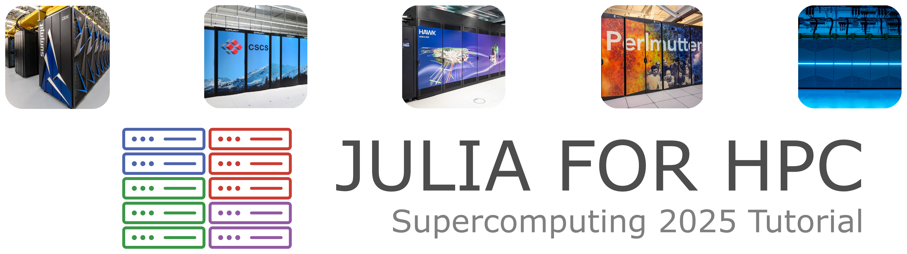

# The Julia Language for Productive High-Performance Computing Tutorial @ SC25

This information will be updated in real time, please check here (and `git pull`) frequently!

Access instructions for the GCP instance: https://go.lbl.gov

If you are interested in more examples and more materials, please check out the [SC 24 Tutorial](https://github.com/JuliaParallel/julia-hpc-tutorial-sc24)
